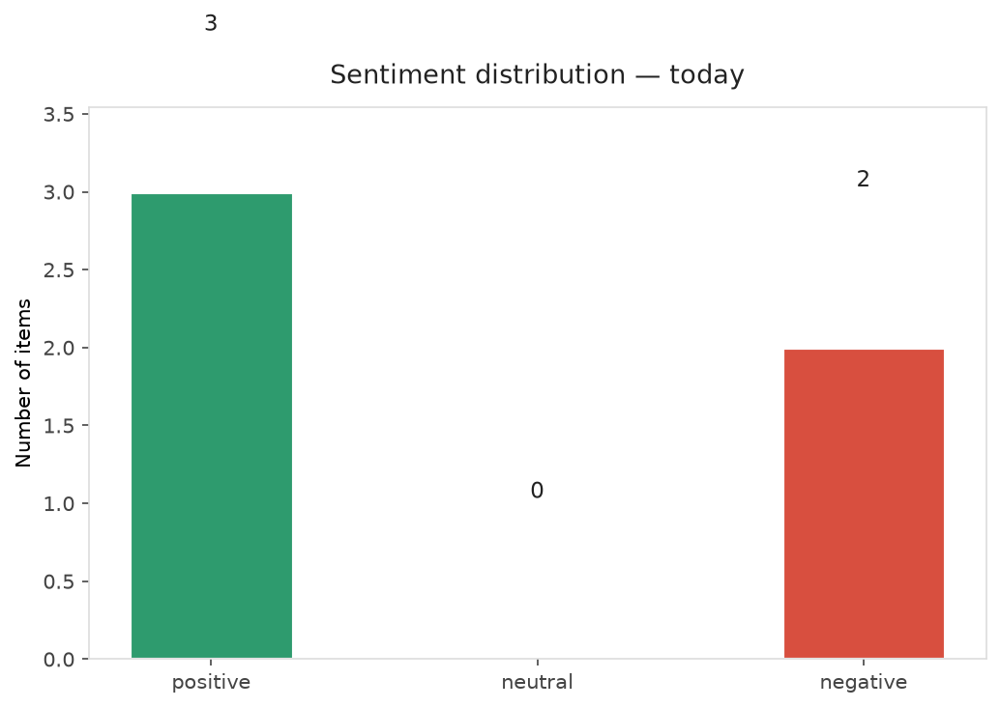
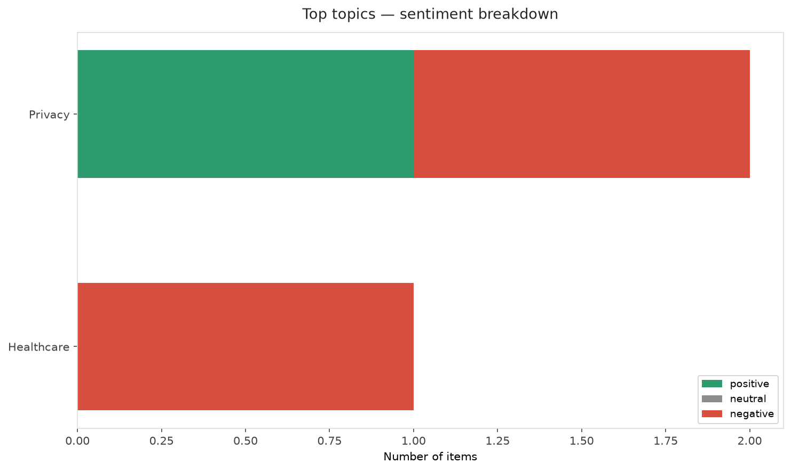
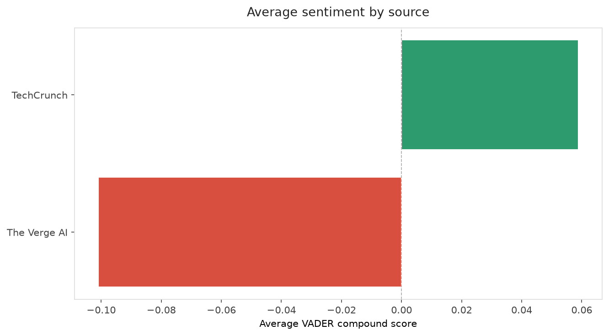
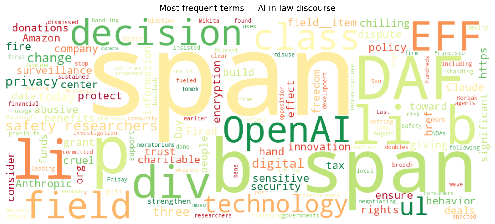
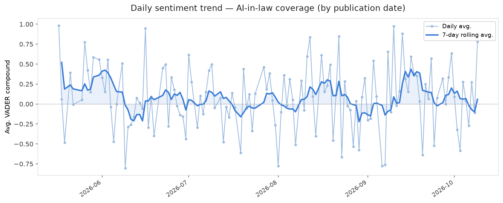
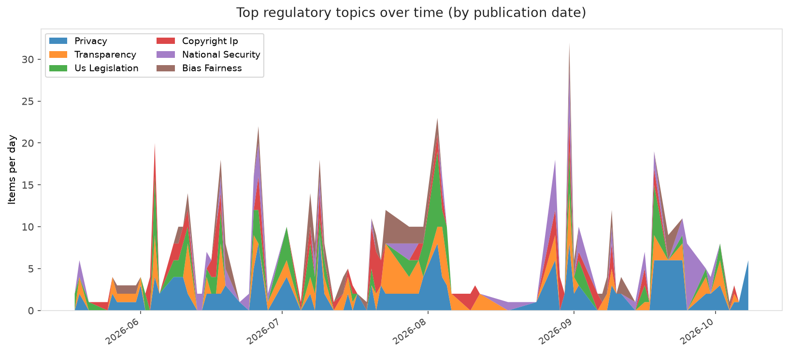
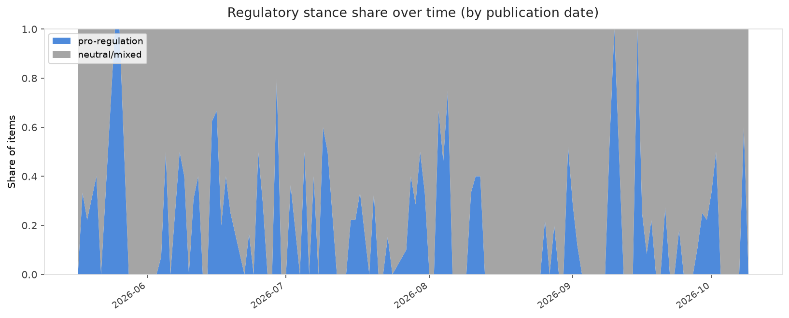

# AI in Law — Daily Sentiment Report
**Run date:** 2026-10-09 | **Items analyzed:** 5 | **Overall:** 🟢 Mildly positive (+0.183)

_Articles in this report were published between **2026-10-08** and **2026-10-09**._

---

## Summary

Today's collection covers **5** items from news outlets, academic preprints, Reddit, and regulatory sources.
Compared to the historical average of **+0.209**, today's sentiment is ↓ **0.026** points lower.

| Metric | Value |
|--------|-------|
| Positive items | 3 (60.0%) |
| Neutral items  | 0 (0.0%) |
| Negative items | 2 (40.0%) |
| Avg. VADER compound | +0.1825 |
| Pro-regulation items | 2 |
| Anti-regulation items | 0 |

---

## Top Topics Today

- **Privacy** — 2 items
- **Healthcare** — 1 items

---

## Most Positive Coverage

- [It's DAF Day! Wait...What's a DAF?](https://www.eff.org/deeplinks/2026/10/its-daf-day-wait-whats-daf)  
  _EFF DeepLinks_ — VADER: `+0.997`
- [Amazon and others are done keeping data center deals secret. Is it enough to build trust?](https://techcrunch.com/video/amazon-and-others-are-done-keeping-data-center-deals-secret-is-it-enough-to-build-trust/)  
  _TechCrunch_ — VADER: `+0.836`
- [OpenAI doubles down on decision to fire three AI safety researchers](https://www.theverge.com/ai-artificial-intelligence/1008604/openai-defends-decision-fire-safety-researchers)  
  _The Verge AI_ — VADER: `+0.727`

---

## Most Critical / Negative Coverage

- [Anthropic bans ‘abusive or cruel behavior’ toward Claude](https://www.theverge.com/ai-artificial-intelligence/1008100/anthropic-new-usage-policy-abuse-claude)  
  _The Verge AI_ — VADER: `-0.929`
- [Fired OpenAI safety researchers dispute misconduct claims, warn of chilling effect](https://techcrunch.com/2026/10/08/fired-openai-safety-researchers-dispute-misconduct-claims-warn-of-chilling-effect/)  
  _TechCrunch_ — VADER: `-0.718`
- [OpenAI doubles down on decision to fire three AI safety researchers](https://www.theverge.com/ai-artificial-intelligence/1008604/openai-defends-decision-fire-safety-researchers)  
  _The Verge AI_ — VADER: `+0.727`

---

## Visualizations — Today

## Visualizations — Trends Over Time

---

## Methodology

- **VADER** (Valence Aware Dictionary and sEntiment Reasoner) — compound score in [-1, 1].
- **Topic tagging** — regex keyword matching across 12 AI-law sub-domains.
- **Stance detection** — keyword-based pro/anti-regulation signal detection.
- **Date filter** — items are kept only if their *publication* date falls within the look-back window (default 2 days).
- Sources: RSS news feeds, arXiv academic API, Reddit (PRAW), Regulations.gov API.

_Generated automatically on 2026-10-09 17:23 UTC._
