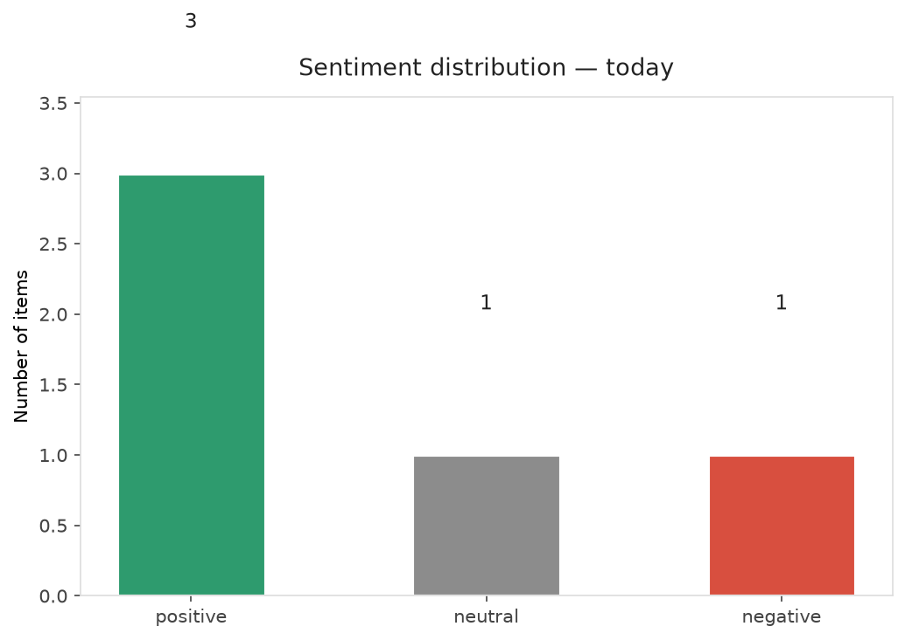
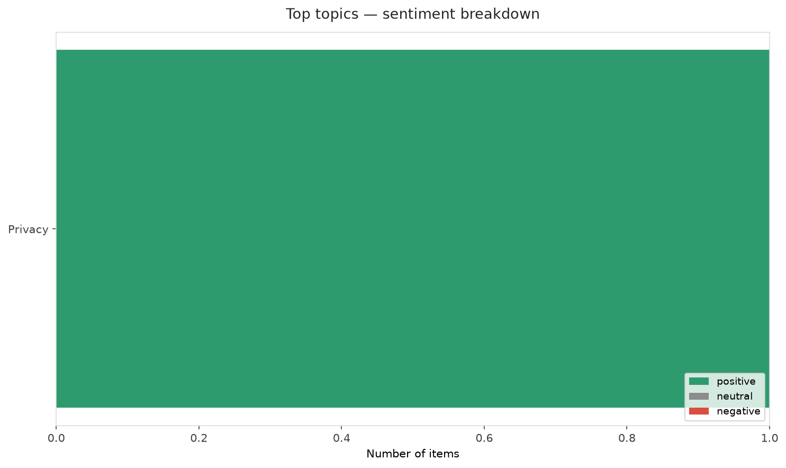
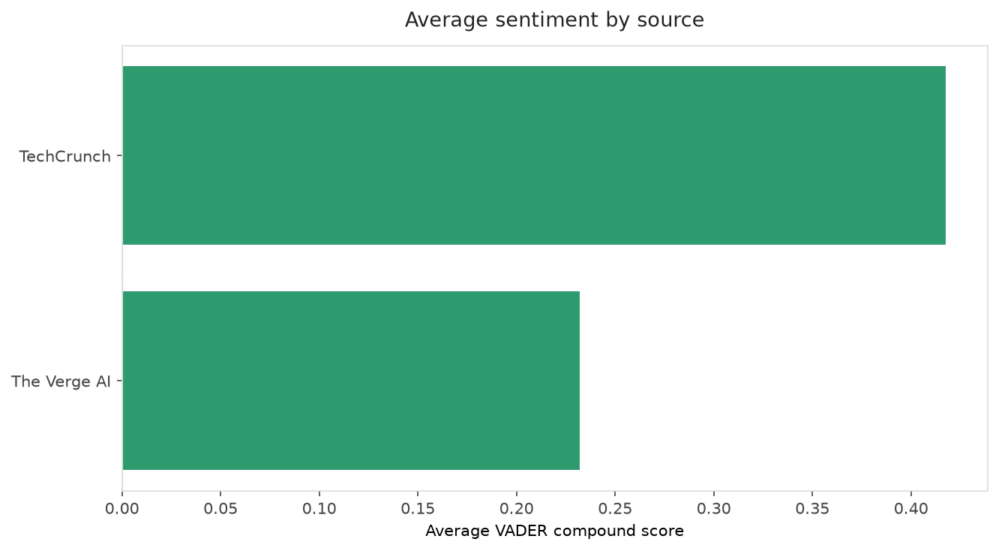
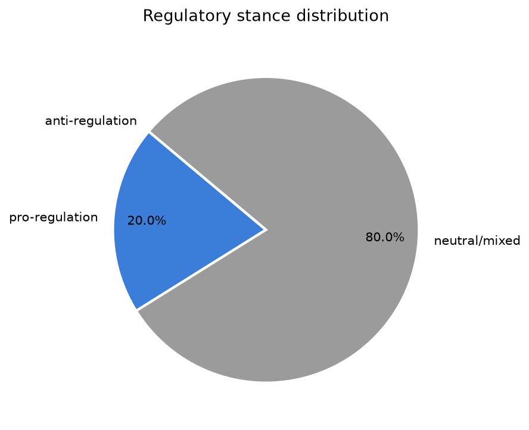
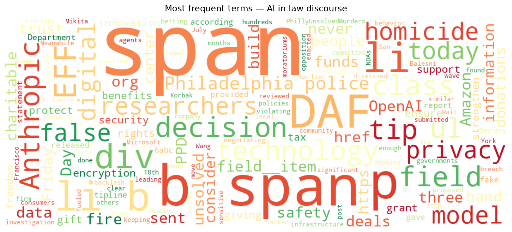
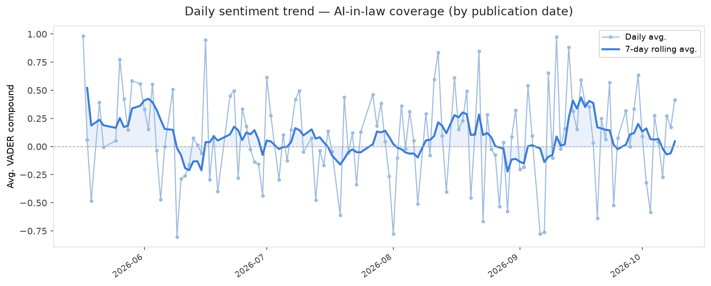
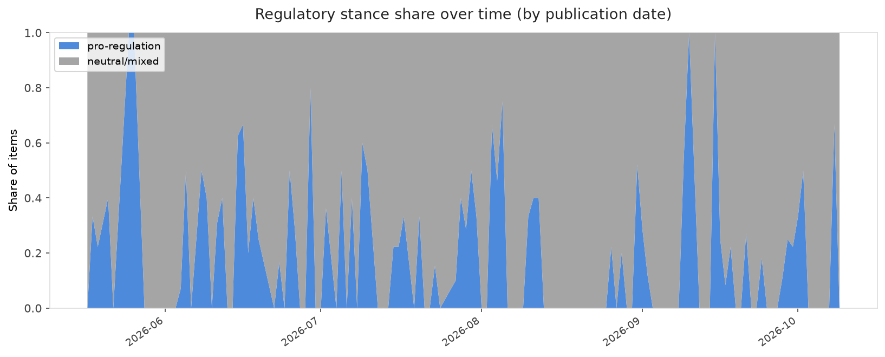

# AI in Law — Daily Sentiment Report
**Run date:** 2026-10-10 | **Items analyzed:** 5 | **Overall:** 🟢 Mildly positive (+0.460)

_Articles in this report were published between **2026-10-08** and **2026-10-09**._

---

## Summary

Today's collection covers **5** items from news outlets, academic preprints, Reddit, and regulatory sources.
Compared to the historical average of **+0.210**, today's sentiment is ↑ **0.250** points higher.

| Metric | Value |
|--------|-------|
| Positive items | 3 (60.0%) |
| Neutral items  | 1 (20.0%) |
| Negative items | 1 (20.0%) |
| Avg. VADER compound | +0.4596 |
| Pro-regulation items | 1 |
| Anti-regulation items | 0 |

---

## Top Topics Today

- **Privacy** — 1 items

---

## Most Positive Coverage

- [It's DAF Day! Wait...What's a DAF?](https://www.eff.org/deeplinks/2026/10/its-daf-day-wait-whats-daf)  
  _EFF DeepLinks_ — VADER: `+0.997`
- [Amazon and others are done keeping data center deals secret. Is it enough to build trust?](https://techcrunch.com/video/amazon-and-others-are-done-keeping-data-center-deals-secret-is-it-enough-to-build-trust/)  
  _TechCrunch_ — VADER: `+0.836`
- [OpenAI doubles down on decision to fire three AI safety researchers](https://www.theverge.com/ai-artificial-intelligence/1008604/openai-defends-decision-fire-safety-researchers)  
  _The Verge AI_ — VADER: `+0.727`

---

## Most Critical / Negative Coverage

- [Anthropic’s AI gave Philadelphia police a fake tip about an unsolved homicide](https://www.theverge.com/ai-artificial-intelligence/1009090/anthropic-fake-homicide-information-philadelphia-pd-tip)  
  _The Verge AI_ — VADER: `-0.262`
- [An Anthropic AI model sent a false homicide tip to Philadelphia police](https://techcrunch.com/2026/10/09/an-anthropic-ai-model-sent-a-false-homicide-tip-to-philadelphia-police/)  
  _TechCrunch_ — VADER: `+0.000`
- [OpenAI doubles down on decision to fire three AI safety researchers](https://www.theverge.com/ai-artificial-intelligence/1008604/openai-defends-decision-fire-safety-researchers)  
  _The Verge AI_ — VADER: `+0.727`

---

## Visualizations — Today

## Visualizations — Trends Over Time

---

## Methodology

- **VADER** (Valence Aware Dictionary and sEntiment Reasoner) — compound score in [-1, 1].
- **Topic tagging** — regex keyword matching across 12 AI-law sub-domains.
- **Stance detection** — keyword-based pro/anti-regulation signal detection.
- **Date filter** — items are kept only if their *publication* date falls within the look-back window (default 2 days).
- Sources: RSS news feeds, arXiv academic API, Reddit (PRAW), Regulations.gov API.

_Generated automatically on 2026-10-10 16:08 UTC._
